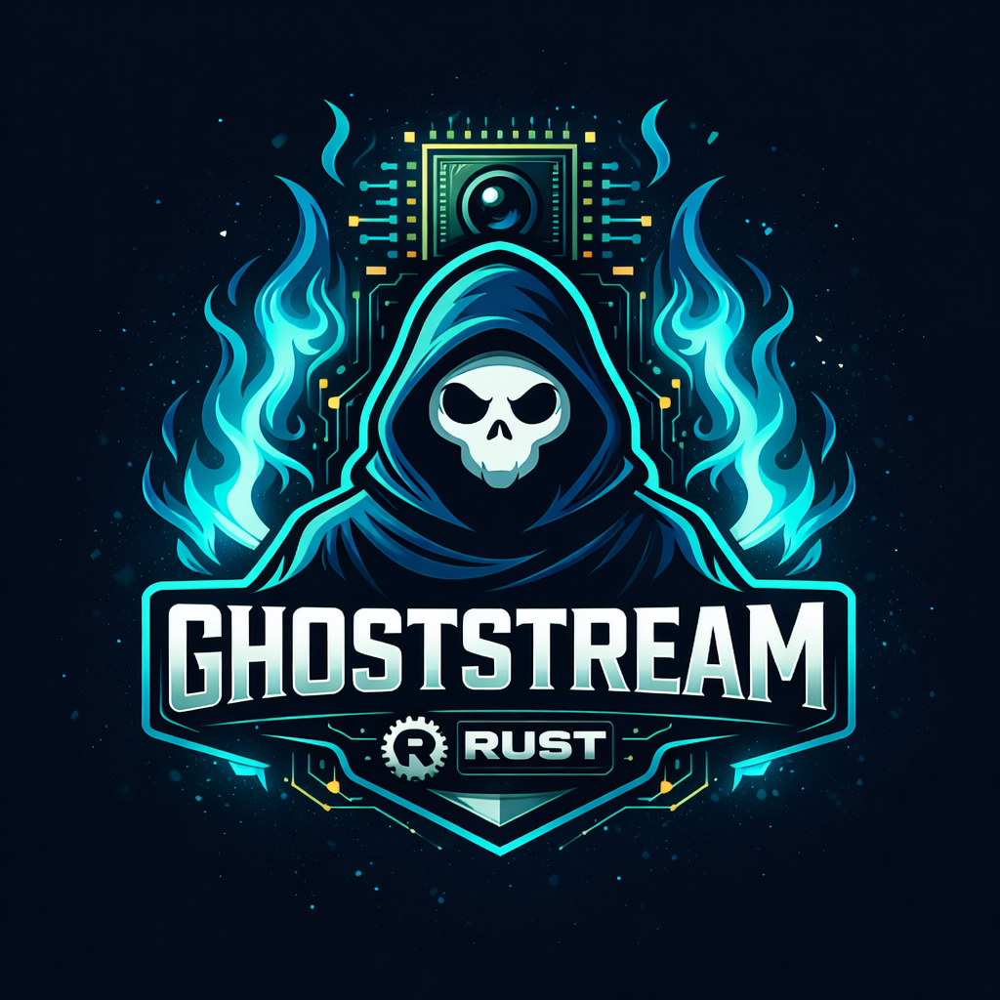

<p align="center">
  
</p>

<h1 align="center">GhostStream</h1>

<p align="center">
  <strong>NVIDIA GPU Video Engine for Rust</strong><br>
  <em>High-performance video capture, encoding, and streaming</em>
</p>

<p align="center">
  <!-- Hardware Encoding -->
  
  
  
  
</p>

<p align="center">
  <!-- Platform & Drivers -->
  
  
  
</p>

<p align="center">
  <!-- CPU Support -->
  
  
  
  
  
</p>

<p align="center">
  <!-- Tech Stack -->
  
  
  
</p>

<p align="center">
  
  
</p>

---

> [!WARNING]
> **Experimental Library** - GhostStream is currently a concept/proof-of-concept and is under active development. APIs may change without notice. Not recommended for production use yet.
>
> **Zen5 Testing Pending** - AMD Ryzen 9 9950X3D testing coming soon once new hardware arrives!

---

## Overview

GhostStream is a first-class Rust library for NVIDIA hardware video encoding, designed for game streaming, screen capture, and real-time video processing. It provides a unified API for both GPU-accelerated (NVENC) and CPU-based encoding with automatic backend selection.

### Key Features

- **NVENC Hardware Encoding** - H.264, HEVC (H.265), and AV1 via NVIDIA GPUs
- **Software Encoding** - x264, x265, and SVT-AV1 optimized for AMD Zen3D/Zen5
- **Wayland Screen Capture** - Secure portal-based capture (KDE, GNOME, Hyprland)
- **PipeWire Integration** - Virtual camera output for Discord, OBS, and more
- **File Recording** - MKV, MP4, WebM, and TS container support
- **Auto Backend Selection** - Automatically chooses NVENC or CPU encoding
- **Low Latency** - Sub-2ms encoding latency with NVENC

## Performance

### NVENC (RTX 5090)

| Codec | FPS @ 1080p | Latency | Notes |
|-------|-------------|---------|-------|
| H.264 | **306.8** | 1.53ms | Dual encoder support |
| H.265 | **305.5** | 1.81ms | 10-bit HDR capable |
| AV1   | **312.2** | 1.75ms | RTX 40/50 series |

### Software (AMD Ryzen 9 7950X3D)

| Codec | Encoder | FPS @ 1080p | Latency | SIMD |
|-------|---------|-------------|---------|------|
| H.264 | x264 | **422.8** | 2.36ms | AVX-512 |
| H.265 | x265 | **195.0** | 5.12ms | AVX2 |
| AV1 | SVT-AV1 | **115.5** | 8.65ms | AVX-512 |

> All codecs achieve real-time encoding at 60fps and above!

## Requirements

### System

- **OS**: Linux (Arch Linux recommended)
- **Display Server**: Wayland (X11 capture not yet supported)
- **Audio Server**: PipeWire 0.3+

### NVIDIA (for NVENC)

- **GPU**: GeForce GTX 600+ (Kepler), RTX 40/50 for AV1
- **Driver**: 580.0+ (Open kernel modules recommended)
- **FFmpeg**: Built with `--enable-nvenc`

### AMD (for Software Encoding)

- **CPU**: Any x86_64 (Zen3D/Zen4/Zen5 recommended for AVX-512)
- **FFmpeg**: Built with `--enable-libx264 --enable-libx265 --enable-libsvtav1`

## Installation

### Add to Your Project

Add GhostStream to your `Cargo.toml`:

```toml
[dependencies]
ghoststream = { git = "https://github.com/ghostkellz/ghoststream" }
```

Or with a specific branch/tag:

```toml
[dependencies]
ghoststream = { git = "https://github.com/ghostkellz/ghoststream", branch = "main" }
```

### Build from Source

```bash
# Clone repository
git clone https://github.com/ghostkellz/ghoststream.git
cd ghoststream

# Build
cargo build --release

# Install CLI (optional)
cargo install --path .
```

### Arch Linux Dependencies

```bash
# Core dependencies
pacman -S rust ffmpeg pipewire libpipewire

# For NVENC (NVIDIA)
pacman -S nvidia-open nvidia-utils

# For software encoding
pacman -S x264 x265 svt-av1
```

## Usage

### CLI

```bash
# System information
ghoststream info

# Screen capture to virtual camera (Discord/OBS)
ghoststream capture --output camera

# Record to file
ghoststream capture --output recording.mkv --codec hevc --bitrate 8000

# Benchmark encoders
ghoststream bench --codec av1 --frames 300

# Force CPU encoding
ghoststream bench --codec h264 --encoder cpu

# Use preset
ghoststream capture --preset discord --output camera
```

### Library

```rust
use ghoststream::{
    Pipeline, PipelineBuilder,
    config::{EncoderConfig, Preset},
    encode::Codec,
    output::Output,
};

#[tokio::main]
async fn main() -> anyhow::Result<()> {
    // Quick start with preset
    let pipeline = PipelineBuilder::new()
        .preset(Preset::Stream1080p60)
        .output(Output::virtual_camera("My Camera"))
        .build()?;

    pipeline.start().await?;

    // ... capture runs ...

    pipeline.stop().await?;
    Ok(())
}
```

### Custom Configuration

```rust
use ghoststream::{
    config::{EncoderConfig, RateControl, EncoderPreset, EncoderTuning},
    encode::{Codec, create_encoder_with_backend, EncoderBackend},
};

// Fine-tuned encoder config
let config = EncoderConfig::default()
    .with_codec(Codec::Hevc)
    .with_resolution(2560, 1440)
    .with_bitrate_kbps(15000)
    .with_preset(EncoderPreset::P4)
    .with_tuning(EncoderTuning::LowLatency)
    .with_rate_control(RateControl::Vbr)
    .with_b_frames(0)
    .with_gop(60);

// Force specific backend
let encoder = create_encoder_with_backend(config, EncoderBackend::Nvenc)?;
```

## Presets

| Preset | Resolution | FPS | Codec | Bitrate | Use Case |
|--------|------------|-----|-------|---------|----------|
| `discord` | 720p | 30 | H.264 | 3 Mbps | Discord streaming |
| `stream` | 1080p | 60 | H.264 | 6 Mbps | Twitch/YouTube |
| `quality` | 1440p | 60 | HEVC | 12 Mbps | High quality |
| `gaming` | 1440p | 120 | HEVC | 15 Mbps | High refresh gaming |
| `4k` | 4K | 60 | AV1 | 25 Mbps | Ultra quality |
| `max` | 4K | 120 | AV1 | 35 Mbps | Maximum (RTX 40/50) |
| `lowlatency` | Native | 60 | H.264 | 8 Mbps | Ultra low latency |
| `recording` | Native | 60 | HEVC | 50 Mbps | Local recording |

## Architecture

```
┌─────────────────────────────────────────────────────────────┐
│                        GhostStream                          │
├─────────────────────────────────────────────────────────────┤
│                                                             │
│  ┌─────────┐    ┌───────────┐    ┌──────────┐    ┌───────┐ │
│  │ Capture │───▶│ Processing│───▶│ Encoding │───▶│Output │ │
│  └─────────┘    └───────────┘    └──────────┘    └───────┘ │
│       │              │                │              │      │
│       ▼              ▼                ▼              ▼      │
│  ┌─────────┐    ┌─────────┐    ┌──────────┐   ┌─────────┐  │
│  │ Portal  │    │ Scale   │    │  NVENC   │   │ Camera  │  │
│  │ (ashpd)│    │ Convert │    │  x264    │   │ File    │  │
│  └─────────┘    └─────────┘    │  x265    │   │ RTMP    │  │
│       │                        │  SVT-AV1 │   │ SRT     │  │
│       ▼                        └──────────┘   └─────────┘  │
│  ┌─────────┐                                               │
│  │PipeWire │                                               │
│  └─────────┘                                               │
│                                                             │
└─────────────────────────────────────────────────────────────┘
```

## Supported Hardware

### NVIDIA GPUs

| Generation | Architecture | H.264 | HEVC | AV1 | Dual Encoder |
|------------|--------------|-------|------|-----|--------------|
| GTX 600/700 | Kepler | ✅ | ❌ | ❌ | ❌ |
| GTX 900 | Maxwell | ✅ | ✅ | ❌ | ❌ |
| GTX 10 | Pascal | ✅ | ✅ | ❌ | ❌ |
| RTX 20 | Turing | ✅ | ✅ | ❌ | ❌ |
| RTX 30 | Ampere | ✅ | ✅ | ❌ | ❌ |
| RTX 40 | Ada | ✅ | ✅ | ✅ | ✅ |
| RTX 50 | Blackwell | ✅ | ✅ | ✅ | ✅ |

### AMD CPUs

| Series | Architecture | AVX-512 | Recommended |
|--------|--------------|---------|-------------|
| Ryzen 5000 | Zen3 | ❌ | Good |
| Ryzen 7000X3D | Zen3D | ✅ | Excellent |
| Ryzen 9000 | Zen5 | ✅ | Best |
| Ryzen 9000X3D | Zen5 + 3D | ✅ | **Ultimate** |

## Desktop Environment Support

GhostStream uses the freedesktop Portal API for secure screen capture:

| Desktop | Support | Notes |
|---------|---------|-------|
| KDE Plasma | ✅ Full | Recommended |
| GNOME | ✅ Full | Works great |
| Hyprland | ✅ Full | Via xdg-desktop-portal-hyprland |
| Sway | ✅ Full | Via xdg-desktop-portal-wlr |
| X11 | ❌ | Not supported (Wayland only) |

## Roadmap

- [x] NVENC encoding (H.264, HEVC, AV1)
- [x] Software encoding (x264, x265, SVT-AV1)
- [x] Portal screen capture
- [x] PipeWire virtual camera
- [x] File recording (MKV, MP4, WebM)
- [x] Auto backend selection
- [ ] RTMP streaming output
- [ ] SRT streaming output
- [ ] Audio capture and encoding
- [ ] HDR support (10-bit P010)
- [ ] DMA-BUF zero-copy capture
- [ ] Intel QSV encoding
- [ ] AMD AMF encoding

## Contributing

Contributions are welcome! Please read our contributing guidelines before submitting PRs.

```bash
# Run tests
cargo test

# Run benchmarks
cargo bench

# Format code
cargo fmt

# Lint
cargo clippy
```

## License

Licensed under the MIT License. See [LICENSE](LICENSE) for details.

## Acknowledgments

- [FFmpeg](https://ffmpeg.org/) - Video encoding foundation
- [pipewire-rs](https://gitlab.freedesktop.org/pipewire/pipewire-rs) - PipeWire Rust bindings
- [ashpd](https://github.com/bilelmoussaoui/ashpd) - Portal API bindings
- [NVIDIA Video Codec SDK](https://developer.nvidia.com/nvidia-video-codec-sdk) - NVENC documentation
